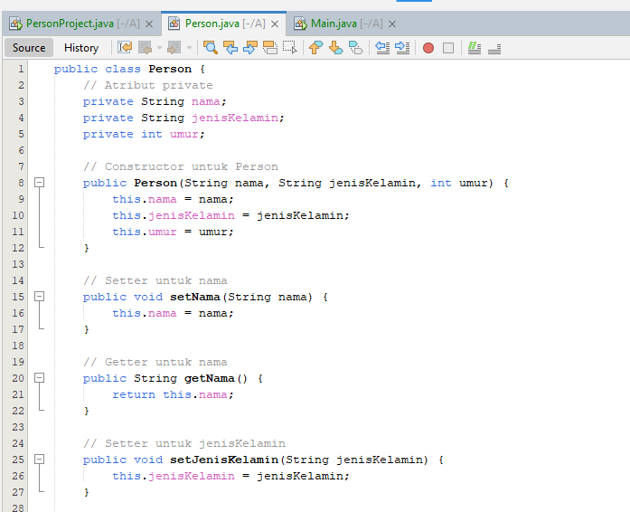
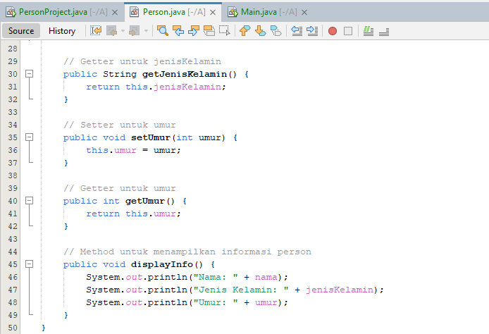
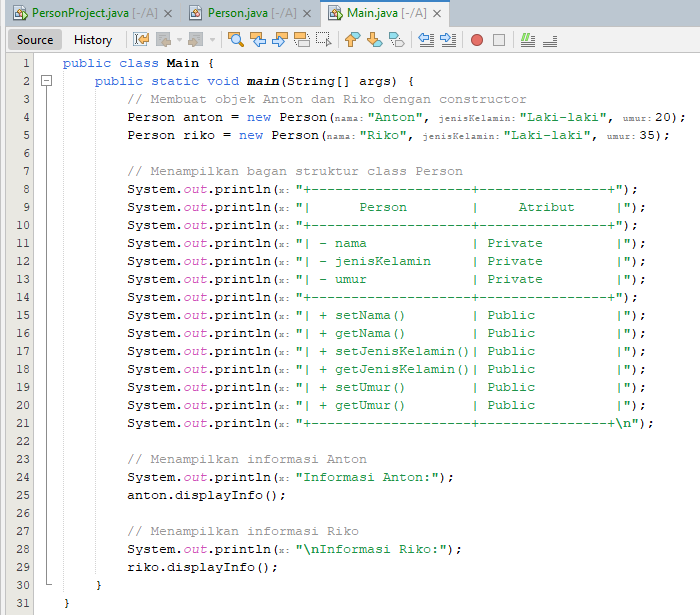
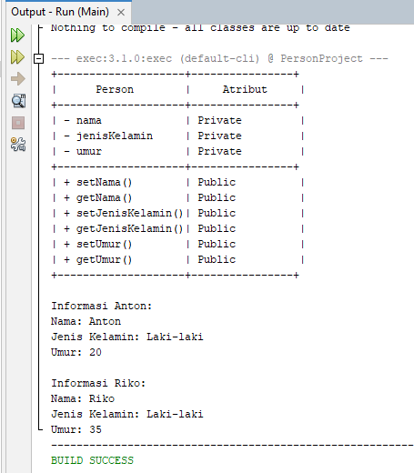

# Person.Java

public class Person {
    // Atribut private
    private String nama;
    private String jenisKelamin;
    private int umur;

    // Constructor untuk Person
    public Person(String nama, String jenisKelamin, int umur) {
        this.nama = nama;
        this.jenisKelamin = jenisKelamin;
        this.umur = umur;
    }

    // Setter untuk nama
    public void setNama(String nama) {
        this.nama = nama;
    }

    // Getter untuk nama
    public String getNama() {
        return this.nama;
    }

    // Setter untuk jenisKelamin
    public void setJenisKelamin(String jenisKelamin) {
        this.jenisKelamin = jenisKelamin;
    }

    // Getter untuk jenisKelamin
    public String getJenisKelamin() {
        return this.jenisKelamin;
    }

    // Setter untuk umur
    public void setUmur(int umur) {
        this.umur = umur;
    }

    // Getter untuk umur
    public int getUmur() {
        return this.umur;
    }

    // Method untuk menampilkan informasi person
    public void displayInfo() {
        System.out.println("Nama: " + nama);
        System.out.println("Jenis Kelamin: " + jenisKelamin);
        System.out.println("Umur: " + umur);
    }
}

# Main.Java

public class Main {
    public static void main(String[] args) {
        // Membuat objek Anton dan Riko dengan constructor
        Person anton = new Person("Anton", "Laki-laki", 25);
        Person riko = new Person("Riko", "Laki-laki", 30);

        // Menampilkan bagan struktur class Person
        System.out.println("+--------------------+----------------+");
        System.out.println("|      Person        |     Atribut     |");
        System.out.println("+--------------------+----------------+");
        System.out.println("| - nama             | Private         |");
        System.out.println("| - jenisKelamin     | Private         |");
        System.out.println("| - umur             | Private         |");
        System.out.println("+--------------------+----------------+");
        System.out.println("| + setNama()        | Public          |");
        System.out.println("| + getNama()        | Public          |");
        System.out.println("| + setJenisKelamin()| Public          |");
        System.out.println("| + getJenisKelamin()| Public          |");
        System.out.println("| + setUmur()        | Public          |");
        System.out.println("| + getUmur()        | Public          |");
        System.out.println("+--------------------+----------------+\n");

        // Menampilkan informasi Anton
        System.out.println("Informasi Anton:");
        anton.displayInfo();

        // Menampilkan informasi Riko
        System.out.println("\nInformasi Riko:");
        riko.displayInfo();
    }
}

# HasilOutput

+--------------------+----------------+
|      Person        |     Atribut     |
+--------------------+----------------+
| - nama             | Private         |
| - jenisKelamin     | Private         |
| - umur             | Private         |
+--------------------+----------------+
| + setNama()        | Public          |
| + getNama()        | Public          |
| + setJenisKelamin()| Public          |
| + getJenisKelamin()| Public          |
| + setUmur()        | Public          |
| + getUmur()        | Public          |
+--------------------+----------------+

Informasi Anton:
Nama: Anton
Jenis Kelamin: Laki-laki
Umur: 20

Informasi Riko:
Nama: Riko
Jenis Kelamin: Laki-laki
Umur: 35

# *Penjelasan Code:*
# Person.java:
*•Class Person memiliki tiga atribut:*
    (nama, jenisKelamin, dan umur, semuanya private.)

*•Terdapat constructor, setter, dan getter untuk setiap atribut.*

*•Method displayInfo() digunakan untuk menampilkan informasi dari object Person.*

# Main.java:
*•Membuat dua object anton dan riko dari class Person.*

*•Menampilkan tabel struktur kelas Person.*

*•Memanggil method displayInfo() untuk mencetak informasi dari masing-masing object.*

